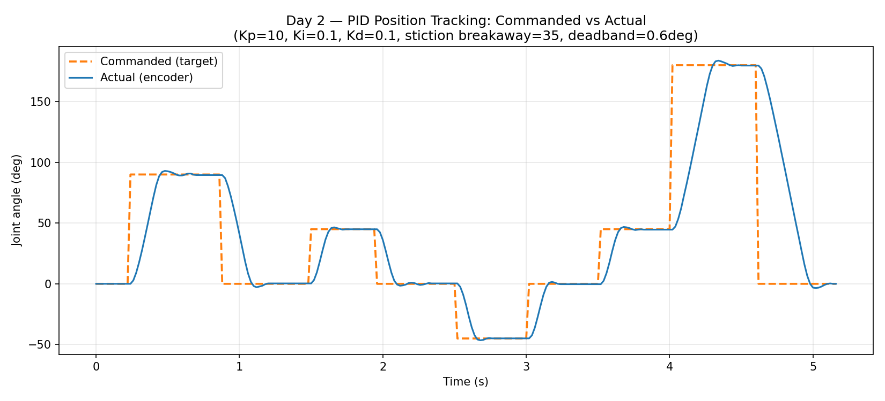
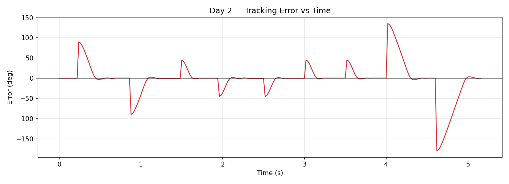

# CAN-Bus Joint Controller

A single-joint robotic motor controller prototype demonstrating closed-loop PID position control over a CAN bus network — built as a portfolio project and architectural prototype for a future quadruped robot.

## System Overview

Two ESP32 nodes communicate over a CAN bus (MCP2551 transceivers):

- **Node A** — Joint controller: drives an N20 motor via TB6612, reads encoder feedback, runs closed-loop PID position control
- **Node B** — Supervisor: sends position commands over CAN, receives status, logs data to PC via USB serial

## Repository Structure

```
can-joint-controller/
├── node_a/          # Joint controller firmware (Arduino/ESP32)
├── node_b/          # Supervisor firmware (Arduino/ESP32)
├── analysis/        # Python data logger + tracking error plotter
│   └── day2_results/  # Day 2 PID step response data and plots
└── docs/            # Circuit diagram, CAN protocol spec, photos
```

## CAN Protocol

See [`docs/can_protocol.md`](docs/can_protocol.md)

## Hardware

| Component | Part |
|---|---|
| Microcontroller | ESP32 (×2) |
| Motor driver | TB6612FNG |
| Motor | N20 with Hall encoder |
| CAN transceiver | MCP2551 (×2) |
| Termination | 2× 220Ω in parallel (~110Ω) at each bus end |
| Power | 2S LiPo (7.4V) + buck converter → 3.3V logic |

## Day 2 Results — PID Tuning

Closed-loop PID position control implemented and tuned on Node A (joint controller).

**Final PID gains:**

| Gain | Value | Notes |
|---|---|---|
| Kp | 10 | Proportional — main tracking gain |
| Ki | 0.1 | Integral — eliminates steady-state error |
| Kd | 0.1 | Derivative — damps overshoot |

Additional tuning: stiction breakaway PWM = 35 (minimum PWM to overcome motor friction), deadband = 0.6° (stops correcting below this error to prevent jitter).

**Step response sequence:** 0° → 90° → 0° → −45° → 0° (repeated across multiple amplitudes)

### Commanded vs Actual Position



### Tracking Error



The motor settles to within the 0.6° deadband within approximately 0.5 seconds at each step. Large transient error spikes at step changes are expected — the controller recovers quickly with no steady-state error remaining.

## Results

*(Final RMS tracking error across sine-sweep trials to be added after Day 5)*

## Phase 2 Plan

Scale to a 2-DOF leg with two joint nodes on the same CAN bus — hardware design and parts list in `/docs/phase2.md`.
