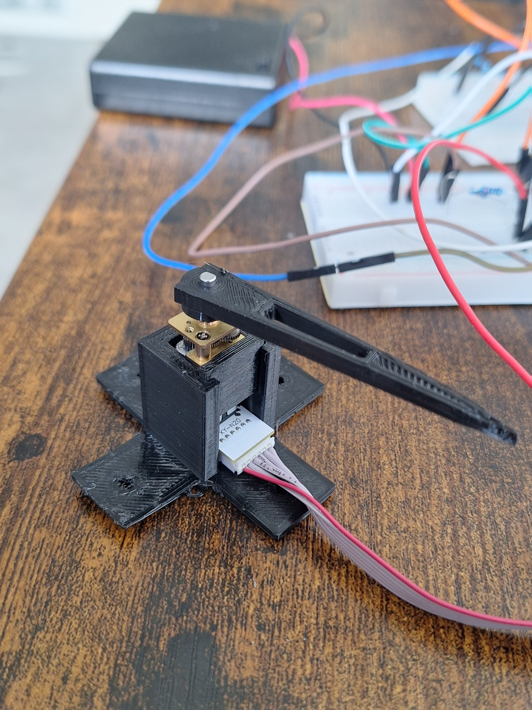
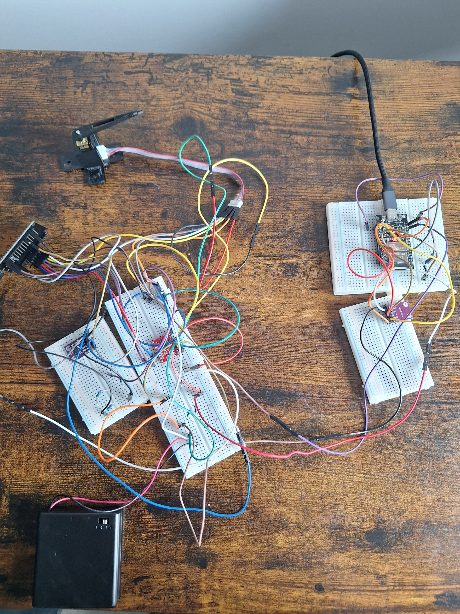

# Distributed Joint Controller over CAN

Two-node ESP32 + CAN-bus system implementing **closed-loop PID position
control of a robotic joint** — a building block toward a quadruped leg.
A target angle typed into the supervisor crosses the bus, the joint
controller drives to it, and status frames stream back.



*Joint assembly: N20 gearmotor in the printed mount, front retaining plate
fitted, D-bore lever keyed to the output shaft.*

**[▶ Demo video](media/demo_joint_step_response.mp4)** — a
`0 → 45 → 90 → 0 → −45` step sequence.

**Status: working end to end.** Steady-state error is **0.0–0.5° across
−45°…180°, within the 0.6° control deadband.** The deadband bounds the
error by construction — the controller stops correcting once inside it, and
tightening it reintroduces the stiction limit cycle found during tuning. So
that figure is a design tradeoff, not a performance ceiling.

---

## System overview

- **Node A — joint controller.** ESP32 + TB6612 H-bridge + N20 gearmotor
  with a quadrature encoder. Runs a 100 Hz PID position loop, receives
  `0x100` position commands, publishes `0x110` status at 10 Hz.
- **Node B — supervisor.** ESP32 + MCP2551. Issues targets from serial
  input, consumes telemetry, and doubles as a CSV logging endpoint.
- **Bus.** 250 kbit/s, ESP32 TWAI driver, MCP2551 transceivers.

```
   [ Serial ]                         CAN bus, 250 kbit/s
   PC / user                       (0x100 cmd  →  0x110 status)
       │                        ┌──────────────┬──────────────┐
       ▼                        │              │              │
   ┌─────────┐   0x100 cmd   ┌──┴───┐      ┌───┴────┐    TB6612 → N20 motor
   │ Node B  │ ────────────► │ CAN  │ ◄──► │ Node A │ ──────────────► ))) joint
   │ super-  │ ◄──────────── │ wire │      │ joint  │ ◄── quadrature encoder
   │ visor   │   0x110 status└──────┘      └────────┘
   └─────────┘
```

## Repository structure

```
firmware/
  node_a_joint_controller/   PID position loop + CAN
  node_b_supervisor/         command entry, status display, CSV logging
  tools/                     CAN bring-up sketches + physical-layer self-test
docs/
  protocol.md                CAN message spec (as implemented)
  hardware.md                pinout, physical layer, termination
  engineering-log.md         CAN fault-isolation writeup  ← start here
cad/                         parametric mount/lever generators + STLs
analysis/                    step-response characterisation, plots, logger
media/                       demo video, wiring photos
```

## Hardware

ESP32 ×2, TB6612FNG driver, N20 gearmotor + quadrature encoder, MCP2551 ×2.
Transceivers run at **5 V** with a **220 Ω / 440 Ω divider on each RX line**
back down to ~3.3 V; ~110 Ω termination per node. Full pinout and the
physical-layer reasoning are in [`docs/hardware.md`](docs/hardware.md).

## CAN protocol

| ID | Direction | Payload |
|----|-----------|---------|
| `0x100` | supervisor → joint | `int16` target, 0.1° units |
| `0x110` | joint → supervisor | pos / target / err `int16` (0.1°), effort `uint8`, flags `uint8` (bit0 = settled) |

Full spec: [`docs/protocol.md`](docs/protocol.md).

## Control

100 Hz PID: **Kp = 10, Ki = 0.1, Kd = 0.1**, with a 35-PWM stiction
breakaway, a 0.6° deadband, and an integral anti-windup clamp; range
−45°…180°. Two failure modes were found and fixed during bring-up:

1. **Direction inversion → positive-feedback runaway** — drive direction
   disagreed with the encoder's counting sense; every correction grew the
   error until PWM saturated. Fixed by swapping the H-bridge logic.
2. **Stiction limit cycle** — integral wound up against static friction and
   oscillated. Fixed with friction compensation and a tighter clamp.

## Results

Step response commanded and observed entirely over CAN, across the full
range. Steady-state error stays inside the 0.6° deadband:

| Command | Settled | Error |
|--------:|--------:|------:|
| 10° | 9.4–10.0° | 0.0–0.5° |
| 20° | 19.7° | 0.2° |
| 45° | 44.6–44.9° | 0.0–0.3° |
| 90° | 89.5–89.8° | 0.1–0.4° |
| 180° | 179.6–180.3° | 0.0–0.3° |
| −45° | −44.9 to −45.2° | 0.0–0.2° |

Full capture, caveats, and the 10 Hz sampling limitation:
[`analysis/step_response_over_can.md`](analysis/step_response_over_can.md).

PID tuning from Day 2 (direct serial, before the bus was integrated):


## Engineering log — the part worth reading

Physical-layer bring-up failed for days; the root cause was **three of five
hand-soldered MCP2551 modules being defective.** It was isolated with a
four-rung diagnostic ladder — status telemetry to make a silent bus
legible, a `TWAI_MODE_NO_ACK` self-test for per-node pass/fail without a
partner, GPIO loopback, and cross-swap — each rung removing one class of
suspect. Verbatim serial captures and bench measurements:
[`docs/engineering-log.md`](docs/engineering-log.md).



*Full bench: joint controller node (left, with motor driver and battery)
and supervisor node (right), linked by a three-wire CAN bus.*

## Mechanical

The motor mount is parametric — original in OpenSCAD, later revisions in
Python (`trimesh`) with a named-constant block per part. The design
iterated under physical testing: closed cylindrical pocket that couldn't be
assembled → horizontal test-fit (wrong plane for the tuned PID) → vertical
shaft-up tower (**used for the working demo**) → a rejected closed-front
rev3 → the current **open-front + slide-in retaining plate** (rev4-lite).
The **D-bore lever, keyed to the motor's D-shaft, is printed and fitted**
(the first bore printed undersized in PETG and was opened up — see the
`fix(cad)` history). Generators and STLs in [`cad/`](cad/).

  ## Instructions for demo

  1. Build the hardware as shown in [`docs/hardware.md`](docs/hardware.md).
     Make sure both ESP32 grounds are connected, CANH connects to CANH, CANL
     connects to CANL, and both MCP2551 RXD lines use the documented voltage
     divider.

  2. Flash Node A with:

     `firmware/node_a_joint_controller/node_a_joint_controller.ino`

     Node A should be connected to the TB6612 motor driver, N20 motor, encoder,
     and one MCP2551 transceiver.

  3. Flash Node B with:

     `firmware/node_b_supervisor/node_b_supervisor.ino`

     Node B only needs the second MCP2551 transceiver and USB serial connection
     to the PC.

  4. Open the serial monitor for Node B at **115200 baud** with **newline**
     line ending enabled.

  5. Type target angles into the Node B serial monitor, for example:

     ```text
     45
     90
     0
     -45

  Node B sends each target over CAN as a 0x100 command. Node A runs the
  PID loop and returns 0x110 status frames.

  6. To log CSV telemetry, type:

     L

     Node B will print:

     ms,pos,target,err,pwm,settled

     Type L again to stop logging. The printed rows can be saved as a CSV and
     plotted with the tools in analysis/ (analysis/).

## Known limitations

Kept deliberately visible:

- **Encoder scaling is unverified against a physical measurement.** 1146
  counts/rev was hand-calibrated and the firmware uses it, but no protractor
  check against a commanded angle was done. All reported angles are
  encoder-derived; **absolute angular accuracy is unconfirmed.**
- **Overshoot on fast steps.** Large moves travel past target and recover:
  89.5°→0 reached −1.5°, 180°→0 reached +1.2°, 0°→−45° reached −47.4° and
  −46.1° on two runs — every recovery at `pwm=35`, the stiction floor. Cause:
  the printed lever's rotational inertia back-driving the joint, with nothing
  damping it because the TB6612 is left in coast (both inputs LOW) rather
  than short brake at zero command. *Roadmap: brake instead of coast on stop.*
- **Telemetry sampling artifact.** Status frames report drive effort from
  the previous control iteration while position and error are sampled at
  send time, so the two disagree for one frame after a target change —
  visible as `err=9.9 pwm=0` in the logs. Documented in `sendStatus()`.
- **No fail-safe.** No heartbeat, command timeout, or watchdog — if the bus
  drops, the joint holds its last target forever.
- **Thin 5 V headroom.** One node's rail sits at 4.6 V (spec min 4.5 V);
  divider midpoints ~2.7 V vs a ~2.5 V threshold. A 3.3 V-native transceiver
  (SN65HVD230, TJA1051T/3) would remove the dividers and the concern.
- **Single joint; unloaded.** Multi-node bus arbitration is untested, and
  step responses carry no external load or disturbance-rejection data.

## Authors

- **Izzatbek Murodjonov ([@inteeed](https://github.com/inteeed))** —
  hardware design, physical-layer bring-up & fault isolation, PID tuning,
  mechanical design
- **Boburjon Radjapov ([@DeadX05](https://github.com/DeadX05))** — CAN
  protocol design, supervisor firmware, integration testing
