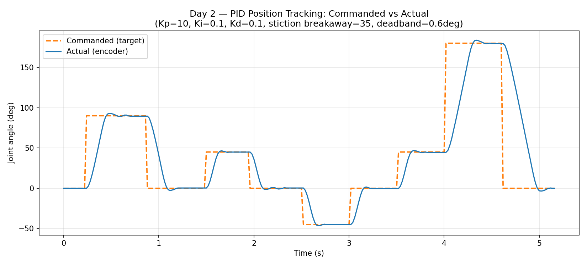
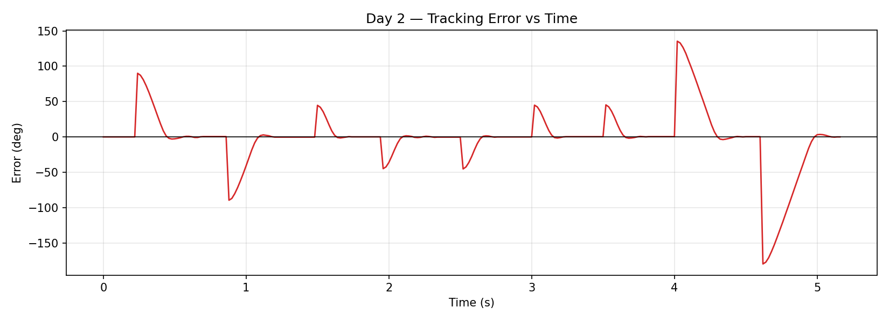

# Distributed Joint Controller over CAN

Two-node ESP32 + CAN-bus system implementing **closed-loop PID position
control of a robotic joint** — a building block toward a quadruped leg.
A target angle typed into the supervisor crosses the bus, the joint
controller drives to it, and status frames stream back.

**Status: working end to end.** Steady-state error is bounded by the 0.6°
control deadband by design; **0.0–0.5° measured across −45°…180°.**

---

## System overview

- **Node A — joint controller.** ESP32 + TB6612 H-bridge + N20 gearmotor
  with a quadrature encoder. Runs a 100 Hz PID position loop, receives
  `0x100` position commands, publishes `0x110` status at 10 Hz.
- **Node B — supervisor.** ESP32 + MCP2551. Issues targets from serial
  input, consumes telemetry, and doubles as a CSV logging endpoint.
- **Bus.** 250 kbit/s, ESP32 TWAI driver, MCP2551 transceivers.

```
   [ Serial ]                         CAN bus, 250 kbit/s
   PC / user                       (0x100 cmd  →  0x110 status)
       │                        ┌──────────────┬──────────────┐
       ▼                        │              │              │
   ┌─────────┐   0x100 cmd   ┌──┴───┐      ┌───┴────┐    TB6612 → N20 motor
   │ Node B  │ ────────────► │ CAN  │ ◄──► │ Node A │ ──────────────► ))) joint
   │ super-  │ ◄──────────── │ wire │      │ joint  │ ◄── quadrature encoder
   │ visor   │   0x110 status└──────┘      └────────┘
   └─────────┘
```

## Repository structure

```
firmware/
  node_a_joint_controller/   PID position loop + CAN
  node_b_supervisor/         command entry, status display, CSV logging
  tools/                     CAN bring-up sketches + physical-layer self-test
docs/
  protocol.md                CAN message spec (as implemented)
  hardware.md                pinout, physical layer, termination
  engineering-log.md         CAN fault-isolation writeup  ← start here
cad/                         parametric mount/lever generators + STLs
analysis/                    step-response characterisation, plots, logger
media/                       demo video, wiring photos
```

## Hardware

ESP32 ×2, TB6612FNG driver, N20 gearmotor + quadrature encoder (1146
counts/rev, hand-calibrated), MCP2551 ×2. Transceivers run at **5 V** with
a **220 Ω / 440 Ω divider on each RX line** back down to ~3.3 V; ~110 Ω
termination per node. Full pinout and the physical-layer reasoning are in
[`docs/hardware.md`](docs/hardware.md).

## CAN protocol

| ID | Direction | Payload |
|----|-----------|---------|
| `0x100` | supervisor → joint | `int16` target, 0.1° units |
| `0x110` | joint → supervisor | pos / target / err `int16` (0.1°), effort `uint8`, flags `uint8` (bit0 = settled) |

Full spec: [`docs/protocol.md`](docs/protocol.md).

## Control

100 Hz PID: **Kp = 10, Ki = 0.1, Kd = 0.1**, with a 35-PWM stiction
breakaway, a 0.6° deadband, and an integral anti-windup clamp; range
−45°…180°. Two failure modes were found and fixed during bring-up:

1. **Direction inversion → positive-feedback runaway** — drive direction
   disagreed with the encoder's counting sense; every correction grew the
   error until PWM saturated. Fixed by swapping the H-bridge logic.
2. **Stiction limit cycle** — integral wound up against static friction and
   oscillated. Fixed with friction compensation and a tighter clamp.

## Results

Step response commanded and observed entirely over CAN, across the full
range. Steady-state error stays inside the 0.6° deadband (the controller
stops correcting once within it — a design parameter, not a measurement
floor):

| Command | Settled | Error |
|--------:|--------:|------:|
| 10° | 9.4–10.0° | 0.0–0.5° |
| 20° | 19.7° | 0.2° |
| 45° | 44.6–44.9° | 0.0–0.3° |
| 90° | 89.5–89.8° | 0.1–0.4° |
| 180° | 179.6–180.3° | 0.0–0.3° |
| −45° | −44.9 to −45.2° | 0.0–0.2° |

Large, fast moves overshoot slightly and are walked back at the 35-PWM
stiction floor — attributed to the printed lever's inertia back-driving the
joint while the driver coasts (both inputs LOW) rather than brakes. Full
capture, caveats, and the 10 Hz sampling limitation:
[`analysis/step_response_over_can.md`](analysis/step_response_over_can.md).

PID tuning from Day 2 (direct serial, before the bus was integrated):




## Engineering log — the part worth reading

Physical-layer bring-up failed for days; the root cause was **three of five
hand-soldered MCP2551 modules being defective.** It was isolated with a
four-rung diagnostic ladder — status telemetry to make a silent bus
legible, a `TWAI_MODE_NO_ACK` self-test for per-node pass/fail without a
partner, GPIO loopback, and cross-swap — each rung removing one class of
suspect. Verbatim serial captures and bench measurements:
[`docs/engineering-log.md`](docs/engineering-log.md).

## Mechanical

The motor mount is parametric — original in OpenSCAD, later revisions in
Python (`trimesh`) with a named-constant block per part. The design
iterated under physical testing: closed cylindrical pocket that couldn't be
assembled → horizontal test-fit (wrong plane for the tuned PID) → vertical
shaft-up tower (**used for the working demo**) → a rejected closed-front
rev3 → the current **open-front + slide-in retaining plate** (rev4-lite).
Generators and STLs in [`cad/`](cad/).

## Known limitations

Kept deliberately visible:

- **No fail-safe.** No heartbeat, command timeout, or watchdog — if the bus
  drops, the joint holds its last target forever.
- **Thin 5 V headroom.** One node's rail sits at 4.6 V (spec min 4.5 V);
  divider midpoints ~2.7 V vs a ~2.5 V threshold. A 3.3 V-native
  transceiver (SN65HVD230, TJA1051T/3) would remove the dividers and the
  headroom concern.
- **Coast, not brake, on stop** — the driver is high-impedance at zero
  command, so nothing damps the lever's momentum; large fast moves
  overshoot. "Brake on stop" is on the roadmap.
- **D-bore lever is designed but unvalidated** — never printed; the motor
  still runs the original round-bore lever, which carries a known slip
  risk.
- **Single joint; unloaded.** Multi-node bus arbitration is untested, and
  step responses carry no external load or disturbance-rejection data.
- **Characterisation sampled at 10 Hz** — transient peaks between status
  frames are not resolved; true overshoot may exceed the reported values.

## Authors

- **[@inteeed](https://github.com/inteeed)** — hardware, physical-layer
  bring-up & fault isolation, PID tuning, mechanical design
- **[@DeadX05](https://github.com/DeadX05)** — CAN protocol, supervisor
  software

Work co-authored on the shared CAN and supervisor commits; hardware,
fault-isolation and mechanical commits are individually attributed.
