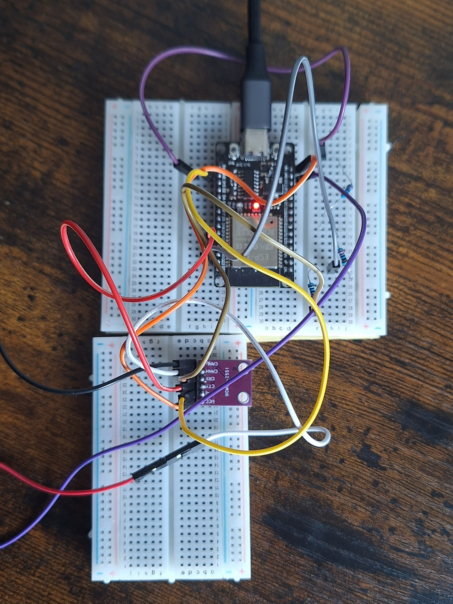

# Hardware

Two-node CAN system: **Node A** (joint controller) and **Node B**
(supervisor), each an ESP32 paired with an MCP2551 CAN transceiver on a
shared 250 kbit/s bus driven by the ESP32 TWAI peripheral.

> This document reflects the **working configuration**. The CAN physical
> layer went through a 3.3 V → 5 V revision during bring-up; see
> `engineering-log.md` for that investigation.

## CAN bus / physical layer

| Signal | Connection |
|---|---|
| MCP2551 CTX (TXD) | ESP32 GPIO21 — direct (3.3 V is a valid logic high in) |
| MCP2551 CRX (RXD) | ESP32 GPIO22 — through a 220 Ω / 440 Ω divider |
| MCP2551 VCC | 5 V (ESP32 VIN) |
| MCP2551 GND | common ground |
| Bitrate | 250 kbit/s (ESP32 TWAI) |

The MCP2551 is specified for a 4.5–5.5 V supply, so the transceivers run
at **5 V**, not 3.3 V. (An earlier 3.3 V configuration was out of spec and
a suspected source of silent frame loss during bring-up — see
`engineering-log.md`.) Because RXD then swings to 5 V, each RX line uses a
**220 Ω / 440 Ω divider** stepping it down to ~3.3 V at the ESP32 input.
TXD needs nothing: 3.3 V is already a valid logic high into the
transceiver.

Measured after the migration: Node A VCC **5.0 V**, Node B VCC **4.6 V**
(in spec but little headroom), RX divider midpoints **~2.7–3.0 V** (above
the ESP32 logic-high threshold, but thin — a 3.3 V-native transceiver such
as the SN65HVD230 or TJA1051T/3 would remove both the dividers and the
headroom concern).

*Node B transceiver and the 220 Ω/440 Ω divider stepping the 5 V RXD output
down to ~3.3 V for the ESP32 input.*

### Bus topology & termination
- CANH ↔ CANH, CANL ↔ CANL, GND ↔ GND between nodes.
- Termination: 2 × 220 Ω in parallel at each node (~110 Ω per node),
  giving **~55 Ω measured across the bus**.

## Node A — motor & encoder

### TB6612 H-bridge
| Signal | Pin |
|---|---|
| AIN1 | GPIO26 |
| AIN2 | GPIO27 |
| PWMA | GPIO25 |
| STBY | GPIO14 (driven HIGH — motor is disabled if LOW) |
| VCC (logic) | 3.3 V |
| VM (motor) | battery + |
| GND | common ground (battery −) |

### Quadrature encoder
| Signal | Pin |
|---|---|
| Ch A | GPIO32 |
| Ch B | GPIO33 |
| Vcc | 3.3 V |
| GND | common ground |

**Counts per rev:** 1146, hand-calibrated — the nominal 7 PPR × 100:1 = 700
figure was wrong on this unit, and the firmware uses 1146. It was derived
from encoder counts, **not** checked against an independent physical angle
measurement, so absolute angular accuracy is unconfirmed (see the README's
known limitations).

## Node B — supervisor

ESP32 + MCP2551 only, CAN wiring as above. No motor hardware — it issues
position-command frames, consumes status frames off the bus, and logs to
the PC over USB serial.

## Pin summary

| Node | Function | Pin |
|---|---|---|
| Both | CAN CTX / CRX | GPIO21 / GPIO22 |
| A | TB6612 AIN1 / AIN2 / PWMA | GPIO26 / GPIO27 / GPIO25 |
| A | TB6612 STBY | GPIO14 |
| A | Encoder Ch A / Ch B | GPIO32 / GPIO33 |
